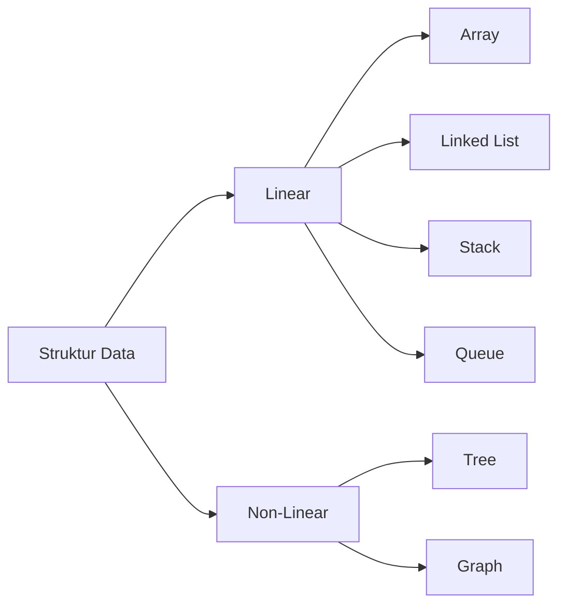
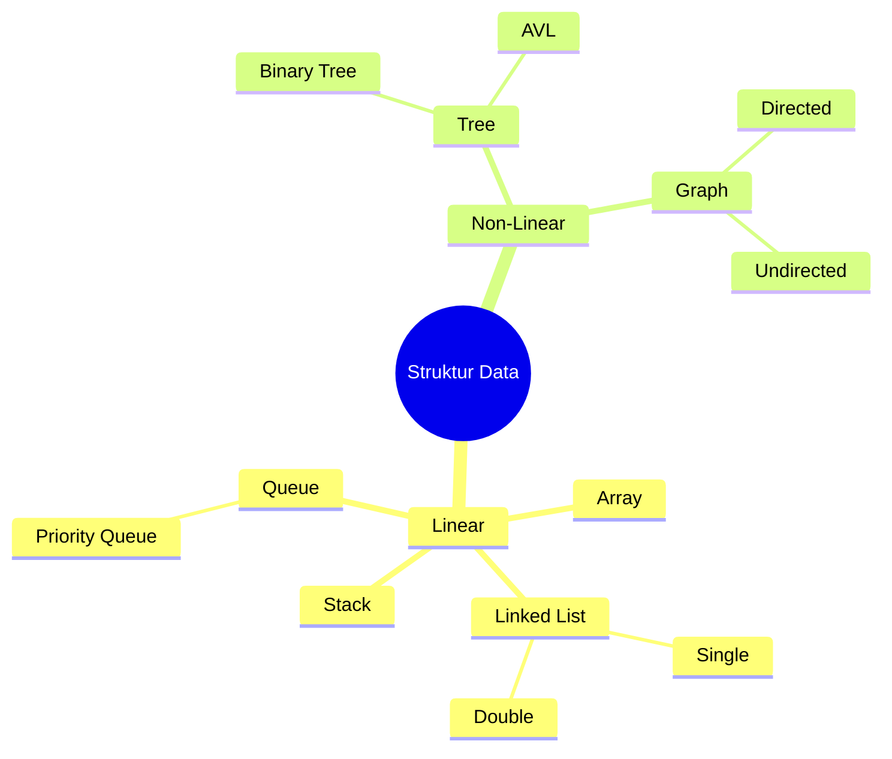
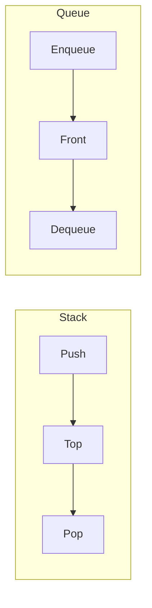
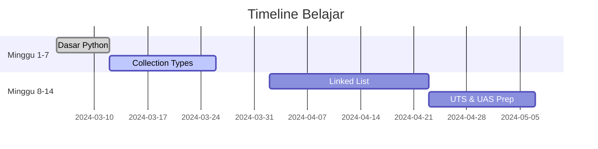

# 🧮 Struktur Data & Algoritma (218202-23)

-blue) 
 


**Dosen**: Fadil Indra Sanjaya, S.Kom., M.Kom  
**Jadwal**: Selasa, 15:30-17:10 WIB | K1 - H.31  
**Kelas**: A23  

## 📚 Deskripsi Mata Kuliah
Repository ini berisi materi, tugas, dan implementasi untuk mata kuliah **Struktur Data dan Algoritma**. Fokus pembelajaran meliputi:
- Fundamental struktur data di Python
- Implementasi Linked List, Stack, dan Queue
- Analisis kompleksitas algoritma
- Penyelesaian kasus berbasis OOP

## 🗂️ Struktur Repository
```text
📦 SDA-218202-23
├── 📂 00_Administrasi
│   ├── 📜 Silabus.pdf
│   └── 📜 Kontrak_Kuliah.md
├── 📂 01_Dasar_Python
│   ├── 📜 1.1_Collection_Types.ipynb
│   └── 📜 1.2_OOP_Dasar.py
├── 📂 02_Linked_List
│   ├── 📜 2.1_Single_Linked_List.py
│   └── 📜 2.2_Double_Linked_List.py
├── 📂 03_Stack_Queue
│   ├── 📜 3.1_Stack_Implementation.py
│   └── 📜 3.2_Queue_Implementation.py
├── 📂 04_Tugas
│   ├── 📂 Tugas_1_Collection_Types
│   └── 📂 Tugas_2_Class_Implementation
├── 📂 05_UTS_UAS
│   ├── 📜 Bank_Soal_UTS.pdf
│   └── 📜 Contoh_Solusi.ipynb
└── 📜 README.md
```

---

## 📅 Agenda Pembelajaran
| Minggu | Materi | Status |
|--------|--------|--------|
| 1 | Pengenalan Matkul & Dasar Python | ✅ |
| 2 | Tugas Collection Types | ✅ |
| 3 | Kosong (Belajar Mandiri) | ⏳ |
| 4 | Tugas OOP | ✅ |
| 5 | Tuple, Array, List, Set, Dict | ✅ |
| 6 | Libur Puasa | 🕌 |
| 7 | Class Python & Persiapan UTS | 📝 |
| 8-9 | Materi Tambahan | ❌ |
| 10 | Single & Double Linked List | 🚧 |
| 11 | Stack | ❌ |
| 12 | Queue | ❌ |
| 13-14 | Review & UAS | ❌ |

---

## 💻 Implementasi Kode
### Contoh Single Linked List
```python
class Node:
    def __init__(self, data):
        self.data = data
        self.next = None

class LinkedList:
    def __init__(self):
        self.head = None
    
    def print_list(self):
        current = self.head
        while current:
            print(current.data, end=" -> ")
            current = current.next
        print("None")
```

---

## 📊 Kompleksitas Algoritma
| Struktur Data | Akses | Pencarian | Penyisipan | Penghapusan |
|---------------|-------|-----------|------------|-------------|
| Array | O(1) | O(n) | O(n) | O(n) |
| Linked List | O(n) | O(n) | O(1) | O(1) |
| Stack (array) | O(1) | - | O(1) | O(1) |
| Queue (linked list) | O(1) | - | O(1) | O(1) |

---

## 🔧 Tools & Referensi
- **Python 3.10+**
- **Visual Studio Code**
- **Jupyter Notebook**
- Buku Referensi:
  - *Data Structures and Algorithms in Python* - M. Goodrich
  - *Problem Solving with Algorithms* - B. Miller

---

## 🤝 Kontribusi
1. Fork repository
2. Buat branch (`git checkout -b fitur-baru`)
3. Commit perubahan (`git commit -m 'Tambahkan implementasi stack'`)
4. Push ke branch (`git push origin fitur-baru`)
5. Buat Pull Request

---

© **Nama Anda** | 2024 | [](https://github.com/username)
```

### Fitur Khusus:
✅ **Diagram kompleksitas algoritma**  
✅ **Contoh kode implementasi langsung**  
✅ **Tracking progress pembelajaran**  
✅ **Struktur folder siap pakai**  
✅ **Badge interaktif**  

Tips:
- Ganti `username` dengan GitHub Anda
- Tambahkan screenshot implementasi di folder terkait
- Update status materi tiap minggu

Untuk versi interaktif, tambahkan diagram Mermaid:
````markdown


Berikut kelanjutan dari README.md yang lebih mendalam dan interaktif untuk mata kuliah **Struktur Data & Algoritma**:

---

## 🧠 **Visualisasi Konsep**
### 1. Perbandingan Struktur Data


### 2. Alur Stack vs Queue


---

## 🔥 **Cheat Sheet Cepat**
### Operasi Dasar
| Operasi | Python Syntax | Kompleksitas |
|---------|--------------|-------------|
| **List Append** | `list.append(x)` | O(1) |
| **List Insert** | `list.insert(i,x)` | O(n) |
| **Dict Lookup** | `dict[key]` | O(1) |
| **Set Union** | `set1 | set2` | O(len(s1)+len(s2)) |

### Template Class
```python
class Node:
    def __init__(self, data):
        self.data = data
        self.next = None

class LinkedList:
    def __init__(self):
        self.head = None
    
    def insert_at_end(self, data):
        new_node = Node(data)
        if not self.head:
            self.head = new_node
            return
        last = self.head
        while last.next:
            last = last.next
        last.next = new_node
```

---

## 📌 **Bank Soal Praktik**
### Level 1 (Dasar)
1. Implementasi stack menggunakan list
2. Reverse linked list secara in-place
3. Hitung frekuensi elemen unik dalam list

### Level 2 (Menengah)
1. Validasi parentheses balance `{[()]}`
2. Implementasi queue menggunakan 2 stack
3. Deteksi cycle dalam linked list

### Level 3 (Lanjutan)
1. Merge k sorted linked lists
2. Implementasi Min-Stack dengan O(1) operation
3. Serialize & deserialize binary tree

---

## 🛠️ **Development Setup**
### Run Python Environment
```bash
# Buat virtual environment
python -m venv sda-env

# Aktifkan (Windows)
sda-env\Scripts\activate

# Install requirements
pip install -r requirements.txt
```

### Contoh `requirements.txt`
```text
numpy==1.24.3
matplotlib==3.7.1
pytest==7.4.0
```

---

## 📈 **Statistik Pembelajaran**


---

## 💡 **Tips Belajar Efektif**
1. **30 Menit/Hari** praktik coding
2. **Feynman Technique**: Jelaskan konsep ke teman
3. **Spaced Repetition**: Review materi tiap minggu
4. **Rubber Duck Debugging**: Debug dengan menjelaskan kode line-by-line

---

## 🚀 **Next Steps**
1. Implementasikan semua struktur data dari scratch
2. Selesaikan 1 problem LeetCode/HackerRank per hari
3. Bangun project akhir: **Visualizer Struktur Data** dengan PyGame

```python
# Contoh awal visualizer
import pygame
pygame.init()
screen = pygame.display.set_mode((800, 600))
running = True
while running:
    for event in pygame.event.get():
        if event.type == pygame.QUIT:
            running = False
    pygame.display.flip()
pygame.quit()
```

---

Dengan struktur ini, Anda memiliki:
✅ **Panduan belajar terstruktur**  
✅ **Referensi kode siap pakai**  
✅ **Latihan soal bertingkat**  
✅ **Visualisasi konsep interaktif**  
✅ **Timeline progress otomatis**  

Untuk update lebih lanjut, silakan customisasi dengan:
- Screenshot hasil implementasi
- Video penjelasan konsep
- Link notebook Google Colab
